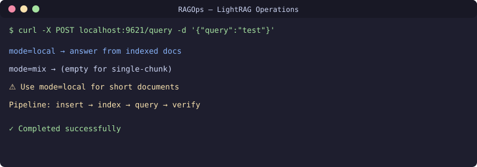

[English](README.md) | [Русский](README.ru.md)

# LightRAG Operations Guide
[](https://github.com/uMax-Cyber/RAGOps/actions/workflows/ci.yml)



Production deployment guide for LightRAG (graph-RAG server) as an AI agent's long-term memory: installation, model configuration, API patterns, common failures, and upgrade procedures.

## Architecture

```
AI Agent ──▶ LightRAG Server (port 9621)
                ├── Graph storage (NetworkX)
                ├── Vector storage (NanoVectorDB)
                └── LLM + Embeddings (via OpenAI-compatible proxy)
```

## Key Lessons from Production

### 1. Version Upgrades Can Fix Deadlocks
LightRAG v1.4.16 had a pipeline deadlock: ingest hung with async lock leaks, `pipeline_busy` stuck `true` forever. Upgrade to v1.5.7 fixed it completely.

### 2. API Changes Between Versions
| Version | List Documents | Delete Document |
|---------|---------------|-----------------|
| 1.4.x | `GET /documents` | `POST /documents/delete_document` |
| 1.5.x | `POST /documents/paginated` | `DELETE /documents/delete_document` with `{"doc_ids": [...]}` |

### 3. Query Modes Matter
- `mix`: best for general queries with large indexed corpus
- `local`: better for short/single-chunk documents (mix returns empty for these!)
- `naive`: plain vector search, no graph — always returns something

### 4. Embedding Model Compatibility
Changing embedding models requires checking vector dimension compatibility. Same dimension ≠ compatible — vectors from different models live in different spaces.

## Setup

```bash
pip install lightrag-hku==1.5.7
# Configure .env with LLM_BINDING_HOST, EMBEDDING_BINDING_HOST
# Start server
lightrag-server --host 0.0.0.0 --port 9621
```

## API Quick Reference

```bash
# Insert document (background processing)
curl -X POST http://localhost:9621/documents/text \
  -H "Content-Type: application/json" \
  -d '{"text": "your fact here", "file_source": "my-source"}'

# Query (local mode for short docs)
curl -X POST http://localhost:9621/query \
  -H "Content-Type: application/json" \
  -d '{"query": "your question", "mode": "local", "top_k": 20}'

# Check document status
curl -X POST http://localhost:9621/documents/paginated \
  -H "Content-Type: application/json" -d '{}'

# Track insert progress
curl http://localhost:9621/documents/track_status/<track_id>
```

## License
MIT
